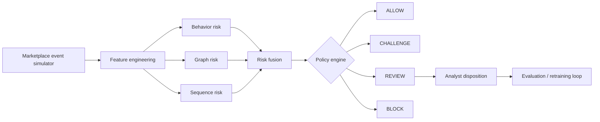

# RiskOS

### Real-Time Trust & Safety Decisioning Lab

RiskOS is a compact, reproducible trust-and-safety platform that simulates marketplace activity, engineers behavioral and graph-style risk features, scores entities, applies operational policy, and optimizes review thresholds under fraud-loss and analyst-capacity constraints.

**Goal:** decide whether an account or marketplace action should be **ALLOW**, **CHALLENGE**, **REVIEW**, or **BLOCK** while balancing fraud capture, false positives, customer friction, and finite review capacity.

## Why this project is different

Most fraud demos stop at model accuracy. RiskOS treats detection as a decision system:

- behavioral and velocity features;
- shared-entity / graph-risk signals;
- sequence-risk signals for suspicious action chains;
- explainable risk fusion;
- policy-based actions;
- analyst review prioritization by expected loss;
- threshold optimization under review capacity;
- feedback labels and monitoring-ready outputs.

## Architecture



## Example signals

- account age;
- new device / new ASN;
- bank-account changes;
- posting velocity vs. baseline;
- failed-payment ratio;
- shared device count;
- suspended-neighbor count;
- high-value exposure;
- suspicious action sequence.

## Quick start

```bash
cd riskos
python -m riskos.demo
python -m unittest discover -s tests -v
```

No third-party packages are required for the baseline demo.

## Example output

```text
entity=carrier_042 risk=0.91 action=REVIEW expected_loss=$18200
reasons=shared_device_with_suspended_entities, bank_change_24h, velocity_spike
```

## Decision science

RiskOS evaluates thresholds with a simple business-cost objective:

```text
expected_cost = missed_fraud_loss
              + false_positive_cost
              + analyst_review_cost
```

A threshold is therefore selected not only for F1, but also for operational capacity and economic impact.

## Safety / scope

All data is synthetic. The project is intended for defensive trust-and-safety research and portfolio demonstration only. It does not connect to real accounts, payments, or production enforcement systems.
